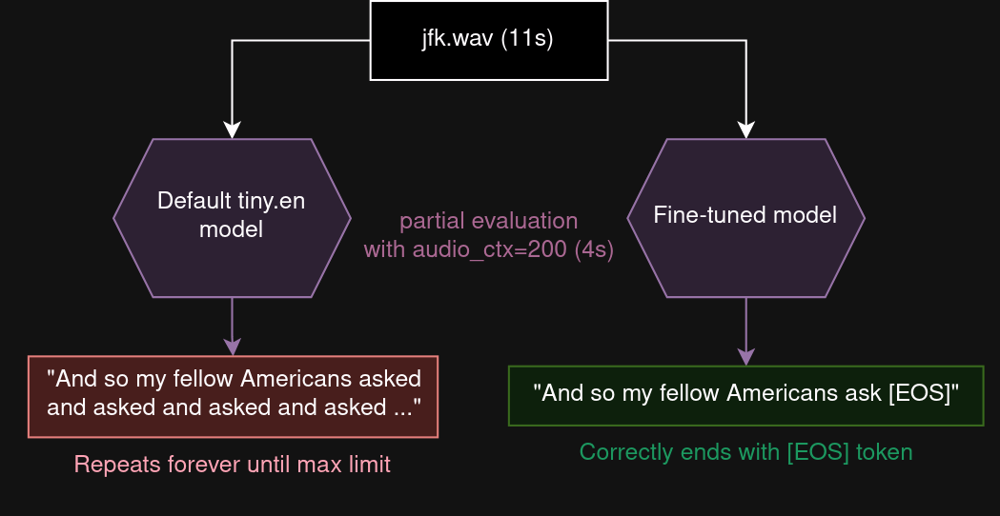
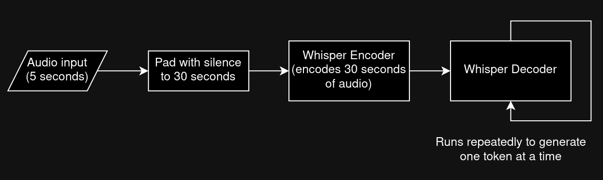
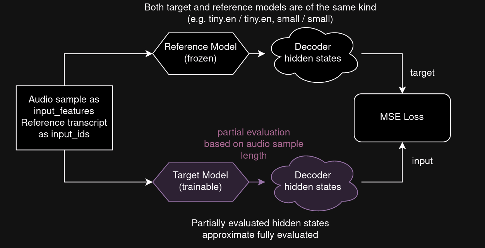

# Finetuning Whisper for dynamic audio context robustness



The idea is to be able to set the `audio_ctx` parameter in whisper.cpp arbitrarily based on audio length (dynamic audio context), without needing to worry about the decoder freaking out and repeating itself.

Try the finetuned models with `-ac`/`--audio-context` argument in whisper.cpp:
* [tiny.en acft](https://voiceinput.futo.org/VoiceInput/tiny_en_acft_q8_0.bin)
* [base.en acft](https://voiceinput.futo.org/VoiceInput/base_en_acft_q8_0.bin)
* [small.en acft](https://voiceinput.futo.org/VoiceInput/small_en_acft_q8_0.bin)
* [tiny acft](https://voiceinput.futo.org/VoiceInput/tiny_acft_q8_0.bin)
* [base acft](https://voiceinput.futo.org/VoiceInput/base_acft_q8_0.bin)
* [small acft](https://voiceinput.futo.org/VoiceInput/small_acft_q8_0.bin)

We've not made versions for medium/large models, but you can make them yourself with the provided notebooks.

## Motive and explanation for anyone uninitiated

The Whisper model is composed of two parts: the encoder which takes in 30 seconds of audio, and the decoder which outputs text.

The main source of latency between the model receiving audio and starting to output text is running the encoder. When running on resource-constrained devices such as phones, this latency can be big and it's important to minimize it in applications such as voice input.



One reason the encoder can be so slow is because the encoder input must always be 30 seconds. Even if the speech is 5 seconds long, it's necessary to add 25 seconds of silence and the encoder must "waste" processing time on those 25 seconds of nothing.

It'd be great if we could skip adding silence and just get the encoder to process whatever length of audio we have. In fact, we can and this is what the `audio_ctx` parameter in whisper.cpp does, which was [implemented after discussion here](https://github.com/ggerganov/whisper.cpp/issues/137).

Unfortunately, the model gets surprised by this and freaks out if you mess with this parameter too much. If you set it too low, usually the decoder doesn't know when to stop, and it'll repeat itself forever.

However, this issue can be mitigated by finetuning the model to tolerate dynamic audio context. The next section proposes a way to do this.

## Finetuning method

A model is loaded (e.g. tiny.en) and a copy of it is made. One will serve as the model to be trained (target model), and one will serve as a reference (reference model).

Given an audio sample and ground truth transcript, the hidden states for both models are calculated. The reference model is evaluated normally, while the target model's encoder is evaluated with dynamic `audio_ctx` based on the audio sample length. L2 loss is used on the hidden states, with the target being the reference model. Simply put, the behavior (hidden states) of the target model (being evaluated with dynamic audio context) is trained to match the reference model (being evaluated normally).



The idea behind this method is to try to preserve the model's knowledge as much as possible, only changing its behavior to match the original model.

## Results

Note: only the first 128 examples in each test set were used, see evaluation.ipynb

The WER on the finetuned model is slightly higher but not too different from the original models, and the WER is much lower than the normal models when using dynamic audio context.

The extreme WER values for the default model with dynamic audio context are caused by the models repeating themselves, causing a high number of insertions. Due to this, the WER can go over 100%.

```
librispeech clean tiny.en:
 * 4.73   - default model, audio_ctx=1500
 * 225.99 - default model, dynamic audio_ctx
 * 4.96   - finetuned model, audio_ctx=1500
 * 5.50   - finetuned model, dynamic audio_ctx
```

```
librispeech other tiny.en:
 * 16.17  - default model, audio_ctx=1500
 * 590.61 - default model, dynamic audio_ctx
 * 17.57  - finetuned model, audio_ctx=1500
 * 16.51  - finetuned model, dynamic audio_ctx
```

```
librispeech clean small.en:
 * 2.77 - default model, audio_ctx=1500
 * 79.7 - default model, dynamic audio_ctx
 * 2.88 - finetuned model, audio_ctx=1500
 * 2.81 - finetuned model, dynamic audio_ctx
```

Despite the finetuning data containing only English, the performance for other languages does not seem to decrease, potentially suggesting the idea of preserving the model's knowledge may have been effective.

```
VoxPopuli de base:
 * 22.47  - default model, audio_ctx=1500
 * 318.15 - default model, dynamic audio_ctx
 * 23.93  - finetuned model, audio_ctx=1500
 * 22.31  - finetuned model, dynamic audio_ctx
```

## Practical application

This was developed for and implemented in [FUTO Voice Input](https://voiceinput.futo.org) (v1.3.2+), an Android voice input application, to significantly decrease latency with short dictations, especially on low-end devices.
